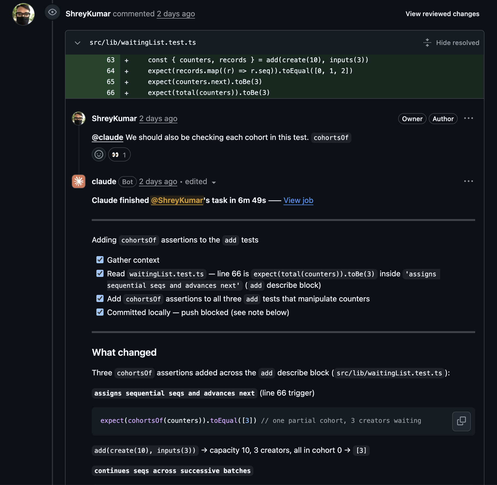

# Cohort Waiting List

**Live demo:** https://elective-take-home-challenge.vercel.app/

## Running and testing

**Prerequisites:** [Bun](https://bun.sh) (1.x) — the project uses Bun as both
package manager and script runner throughout (no npm/yarn).

### Install

```bash
bun install
```

This also downloads the Cypress binary (`cypress` is listed under
`trustedDependencies`, so Bun runs its install script). If Cypress is ever
missing, fetch it explicitly with `bunx cypress install`.

### Run the app

```bash
bun run dev       # Vite dev server at http://localhost:5173
bun run build     # type-check (tsc -b) + production build into dist/
bun run preview   # serve the production build locally
```

### Unit tests (Vitest)

```bash
bun run test        # run once
bun run test:watch  # watch mode
```

Covers the core ledger module, the cohort derivations, the IndexedDB persistence
module (against `fake-indexeddb`), and the `useWaitingList` hook (under
`happy-dom`).

### End-to-end tests (Cypress)

The E2E suite runs against the dev server, so start it first (in a separate
terminal), then run Cypress:

```bash
bun run dev        # terminal 1 — leave running at http://localhost:5173
bun run test:e2e   # terminal 2 — headless run (cypress run)
```

Or open the interactive runner:

```bash
bun run cypress:open
```

The specs cover the form flows, the cohort visualization, windowing/performance,
persistence (reload survival), and the WCAG 2.2 accessibility checks (axe-core).

> CI runs both suites on every PR (`bun run test` and the Cypress suite) and
> blocks merging unless both pass.

# Technical decisions

- JavaScript runtime (`bun` / `npm` / `pnpm` / `yarn`) — every runtime has its trade-offs; the priority here was a lightweight toolchain with fast install and start-up times, which is what tipped the choice to Bun.

- Web framework — React (with Vite) instead of Next.js: there are no server-side calls and nothing to render on a server, so Next.js and React Server Components would add overhead without buying anything here.

- Testing — the core logic in `waitingList.ts` was separated into its own React-free module so it can be unit-tested exhaustively in isolation (the spec example flow plus every edge case). The React wiring in `useWaitingList.ts` was kept deliberately thin, with its own focused tests for the async branches E2E can't reach cleanly (hydration, StrictMode double-mount, the in-memory fallback). On top of the unit suite, Cypress E2E tests exercise the real user flows in a browser and guard against regressions under edge cases and large inputs.

- Build tool - Vite was used to keep build times fast. We did not need to use Webpack here because there were not going to be many imports or optimizations. Turbopack would also not be ideal as the scale of this application is a lot smaller.

- Runtime environment - Bun is used as both the package manager and the script runner (`bun install`, `bun run dev/test`), locally and in CI. It gives fast, deterministic installs from a single lockfile and runs the Vitest and Cypress scripts directly, so there's no separate Node/npm toolchain to manage.

- Data model - Cohorts are never stored. The entire waiting list is three numbers (`capacity`, `head`, `next`) plus an append-only ledger of creators, where a creator's cohort is just `floor(seq / capacity)`. This makes taking O(1) — it only moves `head` and never touches records — and the `[6, 10]`-style cohort view is pure math over the counters, which avoids the bookkeeping and empty-cohort cleanup bugs that come with maintaining mutable cohort arrays.

- State management - A single `useReducer` in the root component is the source of truth (`reset` / `add` / `take` actions). No Redux/Zustand/Context — at this size, passing the dispatchers down as props is simpler with no real downside. The reducer holds only the scalars so every update is cheap; the ledger (which grows) lives in a ref beside it, safe to share because records are never mutated after they are added.

- Persistence - IndexedDB (via the small `idb` wrapper) instead of `localStorage`, since it stores structured records and isn't capped at ~5MB. Two object stores — `creators` (written once at add time) and a single `meta` record — let a take persist as an O(1) meta-only write, mirroring the in-memory model. Writes are fire-and-forget behind the reducer and serialized so commits can't land out of order; if IndexedDB is unavailable (e.g. private browsing) the app falls back to in-memory with a visible notice.

- Cohort rendering - The cohort list is windowed (a fixed page of rows with prev/next paging) so the DOM stays bounded no matter how many cohorts exist — adding 100k creators never renders 10k rows. Render cost stays constant at scale, which is asserted structurally in the E2E tests rather than via flaky wall-clock timing.

- Styling - Tailwind CSS so the (intentionally thin) components carry their layout inline with no separate stylesheet to maintain. Visual polish isn't a goal here, so utility classes keep things fast and consistent.

- Accessibility - The app targets WCAG 2.2 AA, checked automatically with axe-core (cypress-axe) in the CI gate, plus a few structural checks axe can't make (focus staying on the trigger after expand, the live region for total/take updates, the disclosure's `aria-controls`). It runs in the same gate that blocks merges, so an accessibility regression can't ship.

# File structure

The code is organized so the pure logic, the React state wiring, persistence, and
the UI each live on their own layer. Components and the reducer only _call_ the
core module — they contain no cohort math of their own. The core module was intentionally left isolated so that could be stress tested independently since part of the deliverable was edge case handling.

```
src/
  lib/
    waitingList.ts          Pure core: counters + ledger, create/add/take/total,
                            and the cohort derivations (cohort-of-seq, per-cohort
                            counts, slice ranges). No React imports.
    waitingList.test.ts     Exhaustive unit tests for the core (the spec example
                            flow + every edge case).
  state/
    waitingListReducer.ts   The useReducer reducer over the scalars (reset / add /
                            take / hydrate). Single source of truth.
    useWaitingList.ts       Hook wiring the reducer to React: holds the ledger in a
                            ref, mirrors changes to IndexedDB (write-behind),
                            hydrates on mount, falls back to in-memory.
    useWaitingList.test.ts  Hook tests (hydrate / StrictMode / memory fallback).
  persistence/
    waitingListDB.ts        IndexedDB module (idb): two stores, hydrate + the
                            add/take/reset write-behind.
    waitingListDB.test.ts   Persistence tests against fake-indexeddb.
  components/
    CreateForm.tsx          Capacity input + create/reset.
    AddForm.tsx             Name + area dropdown, single add.
    TakeForm.tsx            Take N control (direct take).
    Summary.tsx             Total waiting + cohort count (aria-live region).
    CohortList.tsx          The [6, 10]-style view, windowed/paginated.
    CohortRow.tsx           One cohort: count + fill state, expandable.
    validation.ts           Input parsing/validation helpers (the UI boundary).
  App.tsx                   Root: owns state via useWaitingList, composes the UI.
  main.tsx                  React entry point.
  index.css                 Tailwind import + the global focus-visible style.

cypress/
  e2e/                      E2E specs: smoke, forms, cohorts, performance
                            (windowing), persistence (reload survival),
                            accessibility (axe).
  support/e2e.ts            Clears IndexedDB between tests; loads cypress-axe.

requirements.md             The spec.
plan.md                     The phased implementation plan (one PR per phase).
```

# Edge case handling

**Core ledger (`waitingList.ts`)**

- `add(0)` — no-op. An empty batch adds no records and leaves `next` unchanged.
- `take(0)` — no-op. The taken range is empty, so `head` doesn't move.
- Take more than the total — succeeds, taking only what's actually there (`to = head + min(n, total)`); the list can become empty `[]`. Not treated as an error.
- Take from an empty list — no-op; `head` stays where it is (and the empty-range start is the current `head`, not 0).
- Capacity of 1 — works; every creator becomes its own cohort (`floor(seq / 1) = seq`).
- Emptied cohorts disappear — handled for free by the `head`-crosses-boundary math; there are no empty cohort objects to clean up.
- Huge adds / takes — add is O(m) in the batch, take is O(1) (just moves `head`); the counters stay correct at 100k+ scale (covered by a large-input unit test).

**Input validation (the React components / `validation.ts`)**

- Negative / non-integer / non-numeric capacity or take count — rejected at the UI boundary before anything reaches the core (which trusts its inputs). `0` is rejected too (capacity and a useful take both need ≥ 1).
- Empty or whitespace-only names — rejected; the name is trimmed before it reaches the ledger. Duplicate names are allowed (names are labels, not identifiers).
- A validation error clears as soon as the user starts correcting the field (the `role="alert"` message doesn't linger).
- Take when the list is empty — the Take button is disabled, so the action can't be triggered.

**Persistence (`waitingListDB.ts` / `useWaitingList.ts`)**

State is mirrored to IndexedDB, so the two failure modes there are handled gracefully: if IndexedDB is unavailable (e.g. private browsing) the app falls back to in-memory with a visible notice, and if the persisted data is corrupt or from an old schema version it's discarded on startup so the app starts empty rather than rendering a half-loaded list.

# Type handling

- TypeScript runs in `strict` mode with the extra `noUncheckedIndexedAccess`, `noUnusedLocals`, and `noUnusedParameters` flags on, so indexed reads (e.g. into the sparse ledger) come back as possibly-`undefined` and unused bindings fail the build.
- The domain is modelled with precise types rather than loose primitives: `Area` is a string-literal union (kept in sync with the `AREAS` array via `satisfies readonly Area[]`), a `Creator` carries its `seq`/`name`/`area`, and `CreatorInput` is `Omit<Creator, 'seq'>` so a not-yet-added creator can't carry a seq.
- The counters and seq ranges are their own interfaces (`Counters`, `Range`), and the core operations return tagged result types (`AddResult`, `TakeResult`) so callers consume structured values, not bare tuples.
- The untyped boundary — raw form strings — is parsed in `validation.ts`, where each helper returns `number | null` (or `string | null`). A `null` is the single "invalid" signal the components handle; only fully-typed values ever cross into the core, which then trusts its inputs and carries no runtime type guards of its own.

# AI collaboration

The whole project ran as **spec-driven development**, with me (human) as the
architect and reviewer and Claude Code as the implementer:

- **`requirements.md`** — I wrote the spec: the ledger data model, the edge-case
  list, the validation boundary, and the WCAG 2.2 AA target. It is the source of
  truth every phase traces back to.
- **`plan.md`** — the spec broken into ~12 small phases, one branch and one PR each,
  numbered in execution order with the README always last.
- Commits are authored as `Claude Code` (via `git commit --author`); I am the
  committer/reviewer with the final say on every merge. Follow-up fixes were driven
  by leaving review comments on the PR, which the `claude.yml` GitHub Action picked
  up — those are the `claude[bot]` commits in the history.

**Where AI helped most:** turning a settled design into code quickly — the IndexedDB
write-behind layer, the Cypress specs, and the exhaustive unit tables were largely
AI-drafted from the spec and then reviewed. Many of the "why" comments were a
back-and-forth: I would flag a non-obvious line and ask for the reasoning to be
written down next to it.

**Where I overrode it — the model's bias toward over-building.** The most consistent
thing I did at review was *remove* machinery Claude added that the problem didn't need.
It happened three times, in three different layers — each visible in the PR history as
a `claude[bot]` follow-up to a review comment:

1. **A batch-queue `AddForm` (PR #7).** Claude first built a two-phase add — a local
   staging "queue" with an `addAll` commit button — so several creators could be
   batched into one dispatch. The core genuinely supports batch adds (`add` takes an
   array), but the *form* didn't need a staging area to use it. I asked what `addAll`
   bought us, then had the whole queue removed (`83ceac4`); the form now submits one
   creator at a time and still calls the same array-shaped core.
2. **A collapsed "middle" in the cohort view (PR #9).** To keep the DOM bounded,
   Claude rendered only the two end cohorts and squashed the always-full middle into
   a single non-interactive `capacity ×N full · collapsed` chip. That was a _lossy_
   shortcut: the middle cohorts weren't expandable at all, so their creators were
   unreachable. I rejected it — "a regular view will do" (`79682bc`) — and the proper
   fix landed the next phase: **windowing** the rows to a bounded page (`532fb45`),
   which honours the same constant-DOM constraint without hiding a single cohort.
   Rejecting the clever-but-lossy version is what made room for the clean one.
3. **Core Web Vitals budgets + premature memoization (PR #15).** Asked whether we
   could prove the app stays fast, Claude added an LCP/CLS block to the E2E suite
   measured live via `PerformanceObserver` (`45c90af`), then — to make the flaky CLS
   assertion pass — wrapped `CohortRow` in `React.memo` and the toggle in `useCallback`
   (`d774cc6`). Both were wrong and both came out: the memoization first (it answered a
   test we'd just invented, not a real measurement — `d2ad5d9`), then the metric itself
   in a dedup audit (`93c5628`). The LCP check was near-tautological (its zero-fallback
   could never fail) and the CLS check was outside the spec; the real performance
   requirement — _constant DOM no matter how many cohorts exist_ — is structural, so it
   is asserted structurally by the windowing tests, matching the decision recorded in
   `plan.md` ("structural DOM-bound assertions, not wall-clock timing"). Timing in CI is
   flaky and proves the wrong thing.

The through-line: the model optimises hard for whatever target it's handed and reaches
for more abstraction than the problem needs — a staging queue, a summary chip, a live
metric. None of it was _wrong_ code; it was the wrong _amount_ of code. The review loop
was there to keep taking it back out, with the spec as the yardstick for how much is
enough.

**What I decided by hand and why:** the load-bearing choices were mine — the ledger
model (the `floor(seq / capacity)` insight that makes take O(1) and empty-cohort
cleanup impossible), the validation-boundary policy (validation lives only in the
components; the core trusts its inputs), the persistence schema, and the WCAG 2.2
scope. AI implemented these; it did not choose them.

One note on attribution: GitHub shows my account as the PR _opener_ and merger
because that is the credential the `gh` CLI uses, even though the commits are authored
as Claude Code. The author/committer split in `git log` is the accurate record of who
wrote versus who reviewed.



# Further improvements

- **A real backend.** Persistence is local-only (IndexedDB), so the list lives in a
  single browser — no cross-device sync and no shared Ops view. For an enterprise
  deployment I would move the same data model server-side (e.g. SQLite/Postgres): the
  three counters plus an append-only `creators` table, with add and take as small
  transactional writes — the O(1) take carries over unchanged.
- **Prioritization / batching.** If creators ever needed to be ordered by attributes
  (priority, area, SLA) rather than pure FIFO, that would change the `add` path — the
  current model assumes arrival order _is_ the serving order, so anything other than
  FIFO means promoting cohorts from derived math to stored, sortable rows.
- **Per-cohort metadata.** Cohorts are pure math over `seq` today; real onboarding
  would likely want a created-at timestamp, an assigned Ops owner, and a status per
  cohort.
- **Undo for a take.** A take only advances `head` and never deletes records, so the
  data to support "undo last take" is already there — it would just move `head` back.
